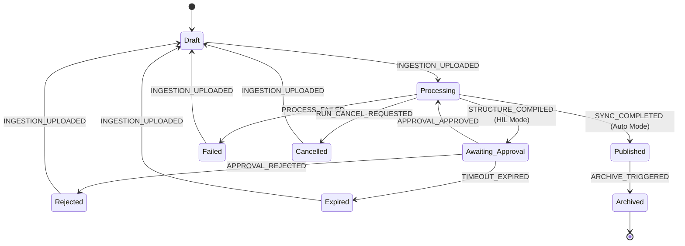
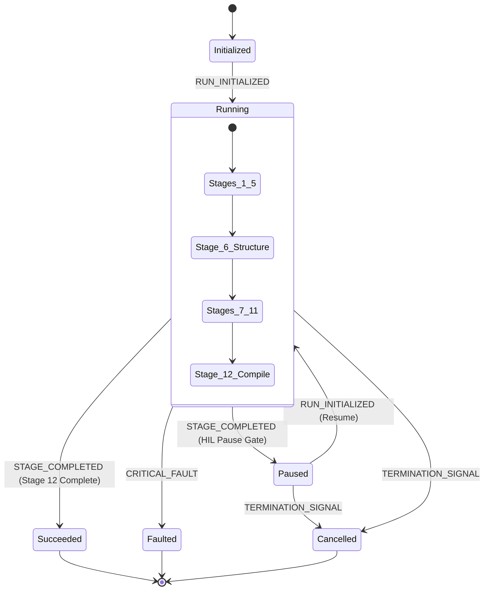
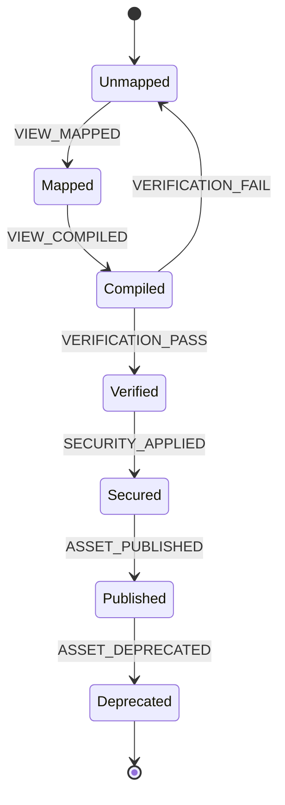

# 08. State Machine & Transitions Specification

---

## 1. State Machine Modeling Rules

Every state machine in the platform MUST be modeled according to the following rules:

* **States:** Distinct, mutually exclusive conditions of an entity at a given point in time.
* **Events:** Stimuli or triggers that cause the state machine to evaluate transitions.
* **Guards:** Boolean conditions that MUST evaluate to true before a transition is authorized.
* **Transition Actions:** Synchronous operations executed *during* the transition (e.g. updating DB values, generating hashes).
* **Side Effects:** Asynchronous operations triggered *after* a successful transition completes (e.g. queueing sync jobs, sending notifications).
* **Initial States:** The default state when an entity is created.
* **Terminal States:** The final state after which no further transitions are allowed (e.g. Archived).
* **Composite States:** States that contain nested sub-state machines (e.g. the "Running" state of a pipeline execution).

---

## 2. Domain Events Registry

### 2.1 Lecture Domain Events
* `INGESTION_UPLOADED`: Triggered when the professor uploads a PDF.
* `STRUCTURE_COMPILED`: Stage 6 completion, structure JSON generated.
* `APPROVAL_APPROVED`: Professor clicks "Save & Approve" in the Node Editor.
* `APPROVAL_REJECTED`: Professor clicks "Reject" in the Node Editor.
* `SYNC_COMPLETED`: Manifest sync completes successfully.
* `PROCESS_FAILED`: Subprocess returns exit code 1 or throws exception.
* `RUN_CANCEL_REQUESTED`: User clicks Cancel.
* `TIMEOUT_EXPIRED`: Inactive duration threshold exceeded.
* `ARCHIVE_TRIGGERED`: Admin archives the course.

### 2.2 Pipeline Run Events
* `RUN_INITIALIZED`: Subprocess starts.
* `STAGE_COMPLETED`: An individual stage completes successfully.
* `CRITICAL_FAULT`: Process crashes or validations fail.
* `TERMINATION_SIGNAL`: Process receives termination signal.

### 2.3 Dynamic View Canvas Events
* `VIEW_MAPPED`: Section mapped to interactive visual type.
* `VIEW_COMPILED`: Code prompts generate initial HTML page.
* `VERIFICATION_PASS`: Verification tests load the page without crashes.
* `VERIFICATION_FAIL`: Render check detects errors.
* `SECURITY_APPLIED`: Domain check injected and script obfuscated.
* `ASSET_PUBLISHED`: Copied to public storage and linked in the section database record.
* `ASSET_DEPRECATED`: Section modified or course archived.

---

## 3. State Ownership & Persistence Strategy

### 3.1 Subsystem Ownership Map
* **Web portal (Laravel):** Owns the `Lecture` state machine and manages the primary database persistence.
* **Pipeline Engine (Python):** Owns the subordinate `Pipeline Run` state machine, persisting its state in intermediate JSON files (`material_config.json`, `manifest.json`).
* **Dynamic View Engine (Browser):** Owns the runtime states of the interactive visual canvases, communicating telemetry back to Laravel via API calls.

### 3.2 Persistence Strategy
* **Laravel States:** Persisted in the primary relational database under status columns (`status`, `is_generated`).
* **Python States:** Persisted in localized run folders (`Materials/[material_name]/`) using configuration state flags.

### 3.3 Inter-Subsystem Synchronization
When the Python pipeline writes state changes to disk, the monitoring background worker checks the output, logs progress, and synchronizes the state to the Laravel database.

---

## 4. Lecture Lifecycle State Machine (Parent)

### 4.1 State Definitions
* **`Draft` (Initial State):** PDF uploaded, not yet processed.
* **`Processing`:** Pipeline is active in the background.
* **`Awaiting Approval`:** Suspended after Stage 6; awaiting professor node verification.
* **`Rejected`:** Professor rejected the structure.
* **`Published` (Terminal/Active):** Fully synced, domain-locked, and live.
* **`Failed` (Terminal/Error):** Processing aborted due to error.
* **`Cancelled` (Terminal/User-Aborted):** Aborted by user request.
* **`Expired` (Terminal/Timeout):** Awaiting approval timeout exceeded.
* **`Archived` (Terminal):** Suspended from student view.

### 4.2 Mermaid State Diagram

### 4.3 Validation Preconditions & Transition Actions
* **Transition:** `Awaiting_Approval` ──► `Processing`
  * **Guard:** Check that page boundaries in modified structure nodes are valid (`page_start` <= `page_end`).
  * **Action:** Overwrite `structure.json` on disk with Node Editor payload.

---

## 5. Pipeline Run Lifecycle State Machine (Subordinate)

### 5.1 Relationship to Lecture Parent
The `Pipeline Run` is a subordinate state machine managed by the parent `Lecture` process. A single Lecture lifecycle can trigger multiple subordinate Pipeline Runs (e.g., Run 1 for Stages 1–6, Run 2 for Stages 7–12).

### 5.2 State Definitions
* **`Initialized`:** Subprocess spawned, files set up.
* **`Running` (Composite State):** Active execution. Contains nested substates matching the stages in [04_Pipeline.md](file:///D:/projects/laravel_projects/college_project/Conversations/04_Pipeline.md):
  * `Extracting` ──► `OCR` ──► `Chunking` ──► `Routing` ──► `Structuring` ──► `KnowledgeGraph` ──► `IngestingQuestions` ──► `RewritingSections` ──► `Validating` ──► `MappingViews` ──► `CompilingCanvases`.
* **`Paused`:** Execution suspended after structure extraction (awaiting parent approval).
* **`Succeeded`:** Execution completed with exit code 0.
* **`Faulted`:** Execution terminated with non-zero exit code.
* **`Cancelled`:** Execution aborted by terminal signal.

### 5.3 Mermaid State Diagram

---

## 6. Dynamic View Canvas Lifecycle State Machine

### 6.1 State Definitions
* **`Unmapped` (Initial State):** Section has no visual assignment.
* **`Mapped`:** Category (e.g. Comparison) and variables defined.
* **`Compiled`:** Prompt script executed, raw HTML code written.
* **`Verified`:** Loaded in a sandbox environment and validated without rendering crashes.
* **`Secured`:** Cryptographic domain checking injected and JS code obfuscated.
* **`Published`:** Linked to active section records in the database.
* **`Deprecated` (Terminal):** Replaced by newer compile runs or archived.

### 6.2 Mermaid State Diagram

---

## 7. Transition Audit Policy

### 7.1 Mandatory Transition Metadata
Every state change inside the primary database MUST log an audit record containing:
* **`previous_state`:** State identifier prior to the event.
* **`new_state`:** State identifier post-transition.
* **`trigger_event`:** The domain event that initiated the change.
* **`timestamp`:** UTC date and time of execution.
* **`actor`:** The user ID of the person triggering the event (or `system_process` if background job).
* **`correlation_id`:** Unique ID mapping the transition to its pipeline execution logs.
* **`transition_reason`:** A text description of why the state changed.

### 7.2 Audit Integration
These transition metrics MUST be written to the `ingestion_audit_logs` table before the database transaction completes, ensuring traceability.

---

## 8. Timeout & Reversion Policies

### 8.1 Awaiting Approval Expiry
If a Lecture remains in the `Awaiting_Approval` state for longer than the threshold defined in the configuration (e.g., `STUDYFLOW_APPROVAL_TIMEOUT_DAYS`), the system MUST automatically:
1. Transition the Lecture status to `Expired`.
2. Revert the active pipeline run to `Cancelled`.
3. Release the course upload lock.

### 8.2 Processing Handshake Timeout
If a background worker process fails to report status or stage updates for longer than the threshold defined in the configuration (e.g., `STUDYFLOW_HANDSHAKE_TIMEOUT_MINUTES`), the Laravel scheduler MUST automatically flag the Lecture status as `Failed`, logging the error code `ERR_WORKER_TIMEOUT`.
