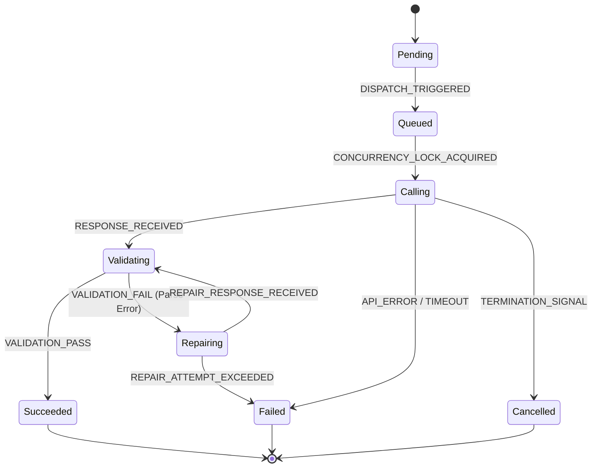

# 17. AI Workflow, Cost Tracking, & Error Repair Specification

---

## 1. AI Execution Principles

### 1.1 Cost and Performance Efficiency
All AI-mediated processing stages MUST optimize for resource efficiency. The system MUST reuse intermediate JSON outputs and deploy prompt caching strategies to minimize token consumption and reduce latency.

### 1.2 Uptime and Reliability Policy
The platform MUST guarantee operation continuation during external API outages. Subsystems MUST implement automated fallback routing, backoff throttles, and offline sandbox simulation testing environments.

---

## 2. AI Provider Abstraction Layer

### 2.1 Provider Interface Abstraction
The `AIClient` module MUST operate as a unified, vendor-neutral abstraction wrapper. Subsystems MUST NOT interact directly with provider-specific SDKs. The abstraction layer translates standardized execution requests into the appropriate target API formats.

### 2.2 Capability & Feature Detection
The abstraction layer MUST dynamically detect and utilize model capabilities based on the active configuration:
* **Structured Output Mode:** Uses provider-native JSON schema constraints where supported.
* **Reasoning Engine Mode:** Routes complex parsing tasks to reasoning-capable models.
* **Streaming and Vision:** Supports frame analysis and data chunk streaming where applicable.

### 2.3 Model Governance & Capability Registry
The system registry defines approved model tiers:
* **Production Tier:** Highly stable, cost-efficient models (e.g. primary model `gemini-2.5-flash`).
* **Advanced Tier:** Complex reasoning models (e.g. fallback model `gpt-4o` or `gemini-2.5-pro`).
* **Experimental Tier:** Blocked from production execution queues.

---

## 3. AI Session Context

### 3.1 Session Envelope Schema
Every AI request MUST include a unified metadata context envelope:
* `correlation_id`: Root API request tracking key.
* `run_id`: Active pipeline execution identifier.
* `tenant_id`: Client university identifier.
* `lecture_id` / `stage_id`: Contextual processing boundaries.
* `route`: Classified domain route (e.g. Medical, Engineering).
* `active_provider` / `active_model`: Active execution parameters.

### 3.2 Session Lifecycle Rules
Context envelopes MUST persist in the processing environment for the duration of the run. Subsystems MUST enforce strict tenant context boundaries, preventing cross-tenant trace leaks.

---

## 4. AI Request Lifecycle

An individual AI call MUST progress through this execution sequence:

```
[ Request Inception ] ──► 1. Context Assembly ──► 2. Model Selection
                                                      │
                                                      ▼
[ Success Output ]   ◄── 5. Cache Sync ◄── 4. Output Validation ◄┘
        │
        ▼ (Parsing Error)
[ Self-Repair Loop ] ──► 6. Repair Pass ──► Re-Validate ──► Succeeded
                                                  │
                                                  ▼ (Failure)
                                          Halt Run (Abort)
```

1. **Context Assembly:** Fetches templates, binds variables, and appends the security invariant block.
2. **Provider & Model Selection:** Queries configurations to set active API routing.
3. **Execution:** Dispatches the payload and logs latency.
4. **Output Validation:** Asserts output conforms to the target JSON schema.
5. **Cache Sync:** Updates local caches with successful outputs.
6. **Repair:** Triggers repair sequences on failure.

---

## 5. AI Execution State Machine

### 5.1 Relationship to Master Lifecycle
The `AI Execution` state machine is a subordinate state machine nested within the "Running" composite state of the main Pipeline Run (defined in [08_StateMachine.md](file:///D:/projects/laravel_projects/college_project/Conversations/08_StateMachine.md)).

### 5.2 State Definitions
* **`Pending`:** Context assembled, waiting for queue release.
* **`Queued`:** Registered in the API gateway concurrency throttle.
* **`Calling`:** Actively waiting for LLM server response.
* **`Validating`:** Checking JSON schema compliance and factuality.
* **`Repairing`:** Executing self-repair instructions.
* **`Succeeded` (Terminal):** Output validated and saved.
* **`Failed` (Terminal):** Execution aborted due to validation or API errors.
* **`Cancelled` (Terminal):** Aborted by user cancellation signal.

### 5.3 Mermaid State Diagram



---

## 6. Output Validation & Self-Repair Workflow

### 6.1 Structured Validation Pass
Every output payload MUST validate against the target JSON contract (from [05_JSONContracts.md](file:///D:/projects/laravel_projects/college_project/Conversations/05_JSONContracts.md)). If validation fails, the parser MUST capture the exception details and trigger the self-repair loop.

### 6.2 Automated Repair Loop
* The orchestrator appends the original output and JSON parsing traceback to the `PR_SELF_REPAIR` template.
* **Repair limit:** The loop MUST execute a maximum of **1 repair attempt**. If the second attempt still fails validation, the execution transitions to `Failed`.

### 6.3 Model Fallback Orchestration
If a call fails due to transient API issues (e.g. rate limit, timeout):
* The system retires using exponential backoff.
* If retries fail, the system dynamically switches the active execution model to the fallback model configured in [15_Configuration.md](file:///D:/projects/laravel_projects/college_project/Conversations/15_Configuration.md) (e.g. `STUDYFLOW_FALLBACK_MODEL`).

---

## 7. AI Cache Strategy

### 7.1 Prompt Caching
The `AIClient` MUST support provider-native prompt caching when compiling long static context headers (e.g. Stage 9 raw textbook inputs), minimizing input token costs.

### 7.2 Response & Semantic Caching
* **Response Cache:** Successful executions of identical inputs and temperatures MUST be cached locally with a TTL of `STUDYFLOW_CACHE_TTL_DAYS`.
* **Semantic Cache:** Dynamic views with matching core concept vectors MAY reuse cached canvases, avoiding redundant generation.

---

## 8. Cost Governance

### 8.1 Budget Limits & Quotas
* **Per-Run Budget:** Ingestion runs MUST be monitored. If execution cost exceeds the threshold defined in the configuration, the orchestrator MUST terminate the run.
* **Per-Tenant Quota:** Monthly API consumption budgets MUST be enforced per university client.

### 8.2 Provider Selection Policies
The orchestrator MUST optimize model routing. It MUST default standard text processing to low-cost models, reserving high-cost reasoning models for fallback passes.

---

## 9. Observability & Runtime Metrics

### 9.1 Latency Performance Gates
Monitoring tools MUST log execution latencies, alerting administrators if P95 response latency exceeds threshold limits.

### 9.2 Operational Metrics
Dashboards MUST track:
* **Repair Rate:** Percentage of runs executing the self-repair loop.
* **Fallback Rate:** Percentage of runs reverting to fallback models.
* **Success Rate:** Percentage of runs reaching the `Succeeded` terminal state.
* **Token Spend:** Total prompt and completion tokens consumed per run.
* **API Availability:** Average availability metrics of external providers.
