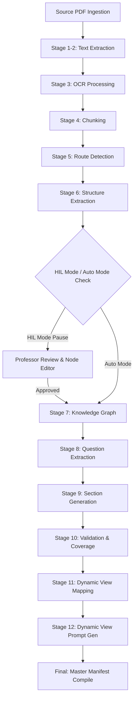

# Technical Specification: Curriculum Ingestion & Interactive Scene Generation Pipeline

This document details the architecture, execution stages, and Laravel-Python integration model for the curriculum processing and Dynamic View prompt generation engine.

---

## 1. Pipeline Architecture & Execution Flow

The generation engine is implemented as a stateless, modular python package located in `Interactive-Seens-Material/Generating`. State is maintained entirely via JSON files in the working directory `Materials/[material_name]/`, allowing independent stage execution and easy debugging.



### The 12 Ingestion Stages:
1. **Intake & Extraction (`extract`):** Parses raw text from the source PDF and cleans encoding anomalies.
2. **OCR Detection (`ocr`):** Scans page text density; if below the threshold, it triggers Tesseract/EasyOCR to parse scanned images.
3. **Text Chunking (`chunk`):** Segments text into 80,000-character blocks while preserving page offsets to prevent token overflow.
4. **Route Detection (`route`):** Runs a two-pass classification (keyword check + LLM call) matching the material to a specialized route (*Medical, Engineering, Computer Science, Mathematics, Physics, General*).
5. **Structure Extraction (`structure`):** AI divides the text into Chapter → Mini-Chapter → Lesson nodes, creating `structure.json`.
6. **Knowledge Graph (`knowledge_graph`):** Maps entities, scientific terms, and their conceptual dependencies.
7. **Question Extraction (`questions`):** Extracts conceptual practice questions from textbook exercises or sections.
8. **Section Generation (`sections`):** Rewrites lesson content into structured, student-oriented sections including core concepts, formulas, real-world analogies, and the toggleable **Egyptian Colloquial Arabic (العامية المصرية) Intuition Analogy**.
9. **Validation (`validate`):** LLM compares generated sections back to the source text, ensuring a curriculum coverage score above 85%.
10. **Dynamic View Mapping (`view_map`):** Maps sections to one of the 5 scene types (*Process, Comparison, Accumulation, Parallel Flow, Time Evolution*).
11. **Dynamic View Prompt Generation (`view_prompt`):** Compiles the executable dynamic view prompts and compiles the interactive HTML/JS canvas scenes.
12. **Master Manifest (`manifest`):** Outputs `manifest.json` compiling execution tokens, costs, run ID, and file locations.

---

## 2. Ingestion Modes (Auto vs. HIL)

Laravel provides two options to the professor when initiating a curriculum ingestion run:

### A. Auto Mode
* **Configuration:** Laravel overrides the Python configuration to set `REQUIRE_HUMAN_APPROVAL_AFTER_STAGE_5 = False`.
* **Execution:** The queue worker runs `python pipeline.py --input source.pdf --name CourseName` and completes stages 1–12 asynchronously in a single run.
* **Database Sync:** Standard practice questions populated in `questions.json` are automatically loaded into the `questions` table as standard practice exercises.

### B. HIL (Human-in-the-Loop) Mode
* **Configuration:** Sets `REQUIRE_HUMAN_APPROVAL_AFTER_STAGE_5 = True`.
* **Stage 1–5 Execution:** Laravel launches the Python script to stop after the structure stage:
  ```bash
  python pipeline.py --input source.pdf --name CourseName --stop-after structure
  ```
* **Dashboard Pause & Node Editor:** The queue worker sets the lecture status to `awaiting_approval`. On the frontend, a visual Node Editor loads `structure.json`. The professor can edit, add, or delete chapters, mini-chapters, and lesson nodes.
* **Stage 6–12 Resume:** Clicking "Approve & Resume" triggers Laravel to invoke the pipeline again, passing the customized `structure.json` and specifying the start point:
  ```bash
  python pipeline.py --name CourseName --start-from knowledge_graph
  ```

---

## 3. Laravel Database Sync & Schema Mapping

Upon pipeline completion, the Laravel queue worker reads `manifest.json`, `sections.json`, and `questions.json`, syncing them to the database.

### Target Table Schema Mapping:

1. **`lectures` (Parent Node)**
   * `title` ⟵ `manifest.json` -> `material`
   * `summary` ⟵ generated summary of the curriculum
   * `pdf_path` ⟵ path of the uploaded source file

2. **`sections` (Granular Learning Units)**
   * `lecture_id` ⟵ ID of the parent lecture
   * `title` ⟵ `sections.json` -> `lessons[i].sections[j].title`
   * `quick_summary` ⟵ `sections.json` -> `lessons[i].sections[j].content.conceptual_summary`
   * `core_concept` ⟵ `sections.json` -> `lessons[i].sections[j].core_concept`
   * `egyptian_explain` ⟵ `sections.json` -> `lessons[i].sections[j].content.arabic_explanation` (Egyptian Colloquial Arabic Analogy)
   * `formulas` ⟵ `sections.json` -> `lessons[i].sections[j].content.formulas`
   * `real_life` ⟵ `sections.json` -> `lessons[i].sections[j].content.real_life_example` (or `clinical_scenario` if route is Medical)
   * `dynamic_view_link` ⟵ Public URL where the compiled HTML scene is copied: `/storage/interactive_scenes/{material}/{view_name}.html`

3. **`questions` / `exam_questions` (Assessment Nodes)**
   * **Ingestion Context:** The upload page contains a check toggle: `"Mark as Previous Exam Paper"`.
     * **If checked:** All questions in `questions.json` are synced directly into the `exam_questions` table.
     * **If unchecked:** Synced into the standard `questions` table.
   * **Manual Promotion:** Professors can toggle and promote any practice question (`questions` table) to an exam question (`exam_questions` table) directly from the dashboard.
   * **Fields Mapping:**
     * `question_text` ⟵ `questions.json` -> `questions[i].question_text`
     * `idea_text` / `idea` ⟵ `questions.json` -> `questions[i].core_idea`
     * `solution_explanation` ⟵ `questions.json` -> `questions[i].solution_explanation` (or required components overview)

4. **`dynamic_view_models` (Visual Canvas Config)**
   * `section_id` ⟵ Linked `Section` record ID
   * `blueprint_json` ⟵ `dynamic_view_mapping.json` section map (objects, actions, variables)
   * `html_content` ⟵ Compiled obfuscated HTML content
   * `is_generated` ⟵ `true`

---

## 4. Compile Security & Domain-Locking (Post-Processing)

To secure the SaaS platform's intellectual property and protect the university's academic content, the final pipeline stage runs a compiler post-processing script:

### A. Iframe Hostname & Referrer Verification
The compiler injects a tamper-proof check script at the head of the generated HTML file:
1. Grabs the rendering context's hostnames:
   * Direct access hostname: `window.location.hostname`.
   * Iframe container hostname (if embedded in LMS): `document.referrer` (parsed to extract domain).
2. Computes the SHA-256 hash of the detected domain alongside a cryptographically random, compilation-injected **salt**.
3. Compares this hash against the pre-compiled, salt-hashed list of authorized university domains.

### B. DOM Wiping & Tamper-Proof Block
* If the domain validation fails, the script immediately executes:
  ```javascript
  document.documentElement.innerHTML = "<h1>Unauthorized Domain - Licensing Violation</h1>";
  window.addEventListener("error", function(e) { e.preventDefault(); }, true);
  ```
* All interactive canvas elements are destroyed, and event listeners are blocked.

### C. Obfuscation & Minification
The Python post-processor minifies the HTML structure and obfuscates the Javascript logic (using standard JS obfuscator tools like `javascript-obfuscator` Node package triggered via Python sub-process, or a python-obfuscation wrapper). Variable names, function names, and comparison salts are mangled to prevent code decoding or manual bypassing.
